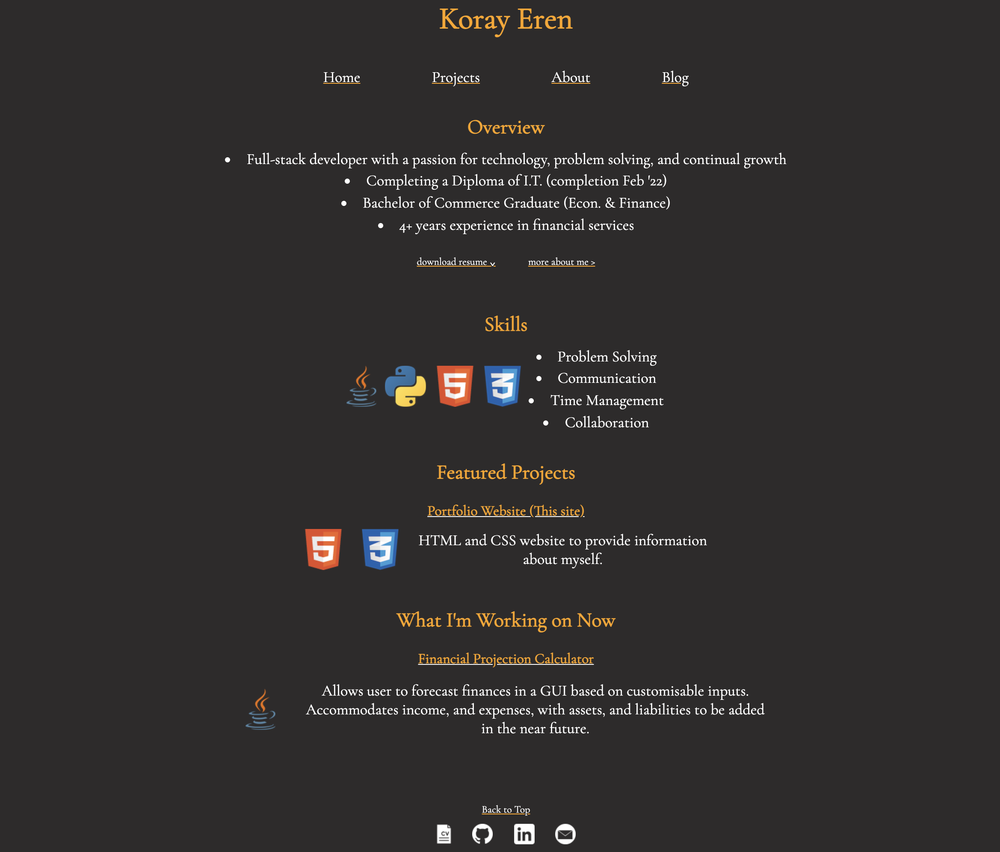
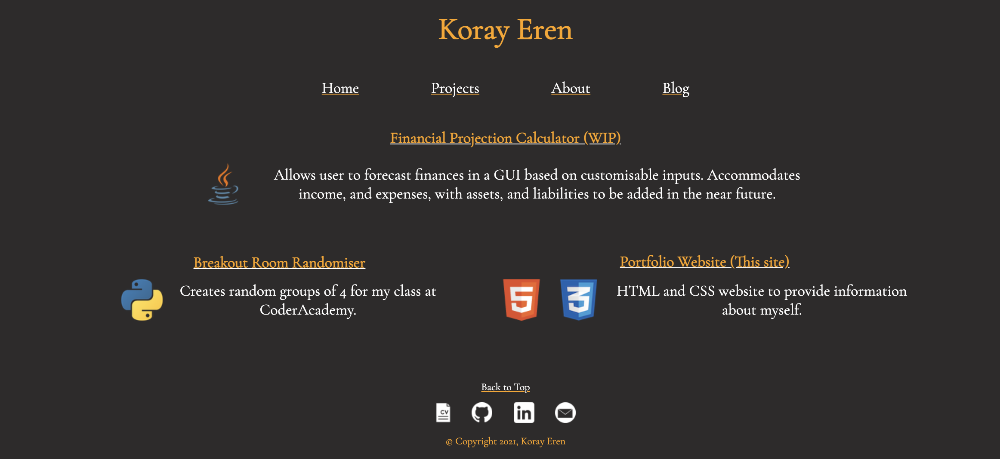
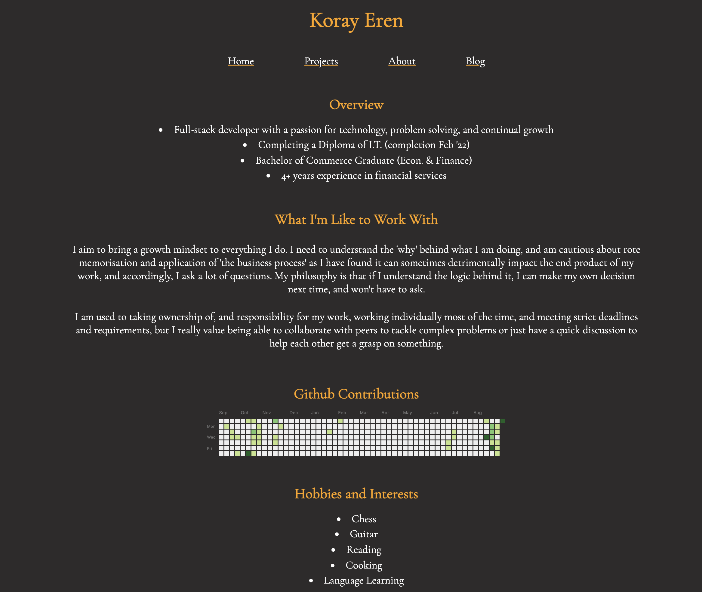
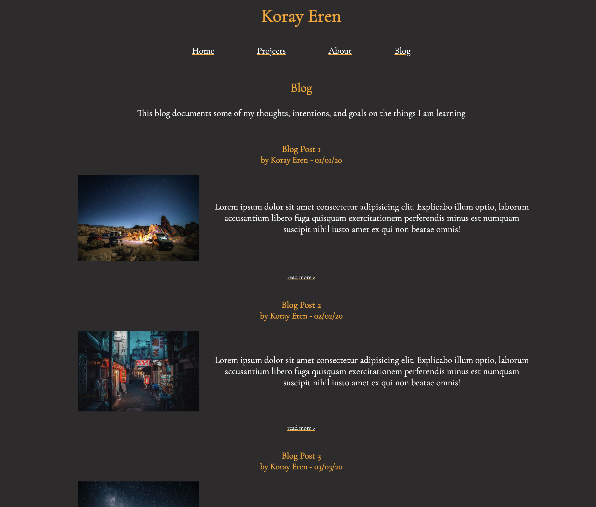

# Portfolio Website

## Deployed Website

<https://korayeren.netlify.app/>

## GitHub Repo

<https://github.com/koray-eren/portfolio>

## Purpose

To provide potential employers and recruiters with resources to make an informed decision, and understand me better, and in a slightly more personal manner than a resume.

## Features

* (Career) Overview
* Skills
* Projects
* What I'm working on now
* What I'm like to work with
* GitHub Contributions Chart
* Hobbies and Interests
* Work and Study History
* Email/Contact Form
* Blog
* Resume download
* Links to socials

## Sitemap

* Home (index)
  * Projects
  * About
  * Blog
    * Blog Post 1
    * Blog Post 2
    * Blog Post 3
    * Blog Post 4
    * Blog Post 5

## Target Audience

* Potential recruiters and employers
* Industry peers

## Tech Stack

* HTML
* CSS
* Deployed on netlify

## Screenshots

